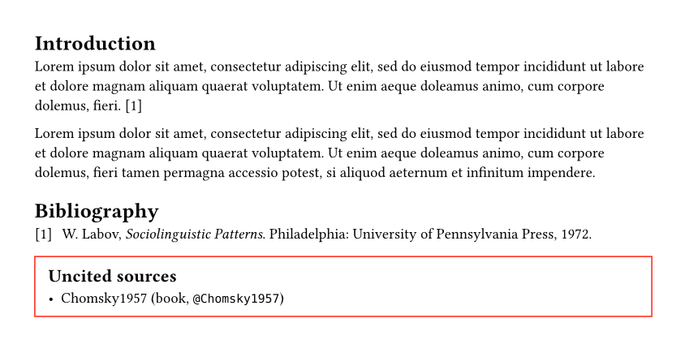

Lately I've become more and more interested in using typst instead of LaTeX for
my papers I need to submit. Mainly due to the cumbersome syntax of LaTeX and
complicated way to building templates with dozens of packages for basic modern
functionalities.

One thing I always wanted to be able to to easily, is to check for uncited
sources in my bibliography file. This can happen quite often, as my initial step
is always searching for many sources and dumping them into my bibliography file.

## Minimal setup

```typst filename="main.typ"
// Content
= Introduction

#lorem(30) @Labov1972

#lorem(40) // @Chomsky1957

// Bibliography stuff

#bibliography("sources.bib")
```

```bibtex filename="sources.bib"
@book{Labov1972,
    Address = {Philadelphia},
    Author = {William Labov},
    Publisher = {University of Pennsylvania Press},
    Title = {Sociolinguistic Patterns},
    Year = {1972}}

@book{Chomsky1957,
    Address = {The Hague},
    Author = {Noam Chomsky},
    Publisher = {Mouton},
    Title = {Syntactic Structures},
    Year = {1957}}
}
```

## Check for uncited sources

In order to this, we need to iterate over each entry in our `sources.bib` file.
This is no native functionality in typst, so we need a small package to do so.
In this case, [`citegeist`](https://typst.app/universe/package/citegeist) has us
covered, and we can simply include it.

So here is a small preview of our base functionality:

```typst
#import "@preview/citegeist:0.1.0": load-bibliography

#let bibtex_string = read("sources.bib")
#let bib = load-bibliography(bibtex_string)

= Preview
#for entry in bib.values() [
    - #entry.entry_key
]
```

Now, we only need to print the entries for which we don't have any label
reference and display a nice message box that tells use, which sources are
not cited yet.

```typst
#let print-uncited-sources = filepath => {
  import "@preview/citegeist:0.1.0": load-bibliography
  let bibtex_string = read(filepath)
  let bib = load-bibliography(bibtex_string)

  let uncided_sources = context {
    let labels = query(ref)

    for entry in bib.values() {
      if labels.filter(a => str(a.citation.key) == entry.entry_key).len() == 0 {
        [- #entry.entry_key (#entry.entry_type, #raw("@" + entry.entry_key))]
      }
    }
  }

  if uncided_sources != none {
    box(
      [
        == Uncited sources
        #uncided_sources
      ],
      inset: 10pt,
      width: 100%,
      stroke: red,
    )
  }
}
```

Now we simply call `#print-uncited-sources("sources.bib")` and we have a list
of our uncited sources in a nice red box.

